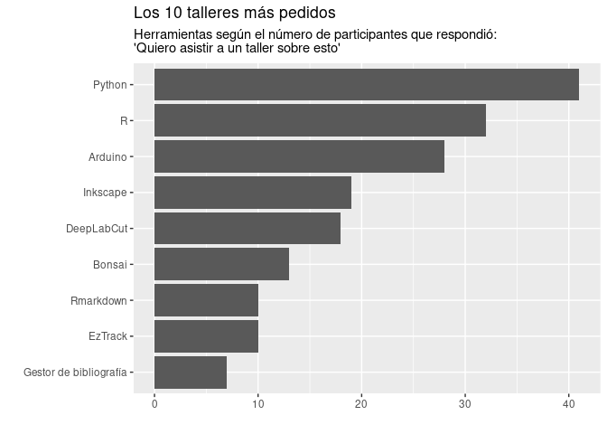

Encuesta Mayo 2021
================
2021-05-28

Participantes de la encuesta fueron consultados acerca de distintas
herramientas y sus ganas de asistir a un taller para
adquirir/profundizar conocimiento.

<!-- -->

La siguiente figura muestra respuestas a “Encuentro que la falta de
financiamiento para hardware y software es un factor limitante para mi
trabajo” o “Encuentro que la falta de capacitación en hardware y
software es un factor limitante para mi trabajo”.

<!-- -->

Este es el segundo ciclo. Tenemos interes de gente nueva?

<!-- -->
